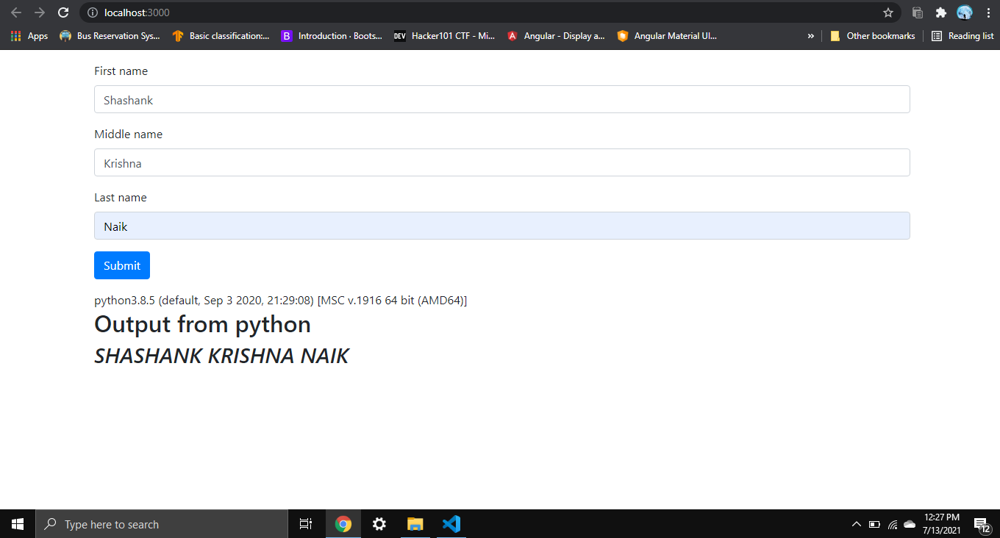

# NodeJS with Python 🤔
Executing python program from NodeJS 🤔. Yeah, it's true, the above program will show how to do it.

Python has many libraries for scientific computing, data analytics, and machine learning, whereas JavaScript does not. Integrating NodeJS with python helps in solving many problems. 

<h2>Dependencies</h2>
<ul>
    <li>Python</li>
    <li>NodeJS</li>
    <ul type="circle">
        <li>ExpressJS</li>
        <li>child_process - The Node.js child_process module has two methods spawn() and exec(), using which we can start a child process to execute other programs on the system. For more information click <a href="https://www.hacksparrow.com/nodejs/difference-between-spawn-and-exec-of-node-js-child-rocess.html">this</a> link</li>
    </ul>
</ul>
 

<h2>Steps</h2>

step 1: First create a directory for your new application and navigate into it.

<pre>
mkdir myapp
cd myapp
</pre>

step 2: Use the npm init command to create a package.json file for your application.

<pre>
npm init
</pre>

step 3: Copy above code paste it in the myapp directory.

step 4: Run the application.

<pre>
node app.js
</pre>

<h2>Result</h2>

<h2>Reference</h2>
<ul>
    <li>https://codewithhugo.com/integrate-python-ruby-php-shell-with-node-js/</li>
    <li>https://www.hacksparrow.com/nodejs/difference-between-spawn-and-exec-of-node-js-child-rocess.html</li>
</ul>
